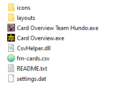

# Card-Overview
Card Overview (v1.1.3) by Fraser Elliott aka FraserNotFrasier

Forked by sg4e to implement auto-tracking for FM Team Hundo

# FM Team Hundo auto-tracking

First, download the original version of the program if you don't have it already:
https://github.com/fraserelliott/Card-Overview/releases/tag/v1.1.3

Then, download the [latest release of this fork](https://github.com/sg4e/Card-Overview/releases/latest), extract it, and then drop `Card Overview Team Hundo.exe` into the original version's directory, like this:

Run `Card Overview.exe` for your regular FM runs, and `Card Overview Team Hundo.exe` when playing FM Team Hundo. Be careful not to run both at once!

For more info about FM Team Hundo, go to https://hundo.maika.moe
